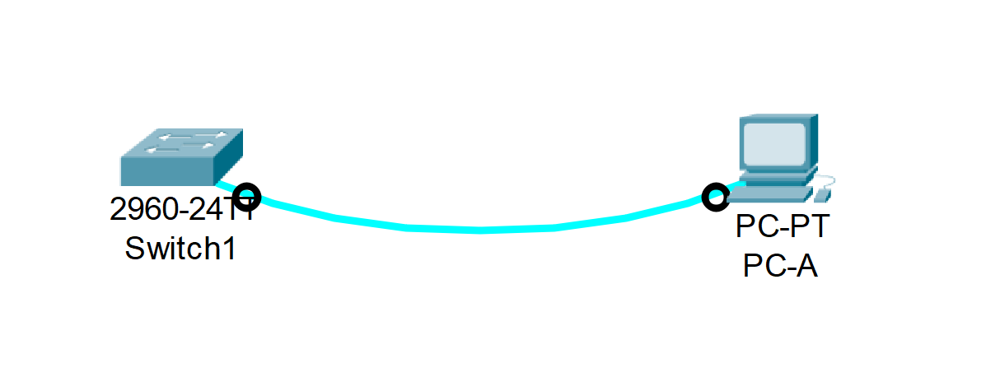
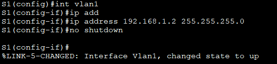

# Базовая настройка коммутатора

##  Задачи

#### Часть 1. Проверка конфигурации коммутатора по умолчанию

#### Часть 2. Создание сети и настройка основных параметров устройства
- Настройте базовые параметры коммутатора.
- Настройте IP-адрес для ПК.

#### Часть 3. Проверка сетевых подключений
- Отобразите конфигурацию устройства.
- Протестируйте сквозное соединение, отправив эхо-запрос.
- Протестируйте возможности удаленного управления с помощью Telnet.

## Выполнение: 

### Часть 1. Создание сети и проверка настроек коммутатора по умолчанию
#### Создаём сеть согласно топологии:


Подсоединяем консольный кабель. Ethernet кабель на данном этапе отключен.

Консольное подключение установлено:


Почему нужно использовать консольное подключение для первоначальной настройки коммутатора? Почему нельзя подключиться к коммутатору через Telnet или SSH?

\- Коммутатор сброшен до заводских настроек. Загрузочная конфигурация отсутствует -  подключение через Telnet и SSH ещё не настроено. Поэтому первоначальная настройка возможна только через консоль.

#### Проверяем настройки коммутатора по умолчанию (в привилегированном режиме): 


На коммутаторе 2960 имеется 24 интерфейса FastEthernet  и 2 интерфейса GigabitEthernet.
Диапазон значений VTY линий 0 - 15.

При вводе команды `show startup-config`  выводится сообщение:  `startup-config is not present` так как загрузочная конфигурация отсутствует.
#### Изучим характеристики Vlan1:
- IP адрес не назначен:  `no ip address`
- Интерфес выключен:  `shutdown`
- MAC-адрес `00d0.bc2b.ded7`

#### Сведения о версии ОС Cisco IOS :
Версия  ОС Cisco IOS: `15.0(2)SE4`
Файл образа системы: ` c2960-lanbasek9-mz.150-2.SE4.bin`

#### Подсоединяем Ethernet кабель к PC-A и к порту 6 на коммутаторе:
```
%LINK-5-CHANGED: Interface FastEthernet0/6, changed state to up
%LINEPROTO-5-UPDOWN: Line protocol on Interface FastEthernet0/6, changed state to up
```
#### Свойства интерфейса FastEthernet 0/6 :
- Интерфейс включен
- MAC-адрес `00d0.97eb.7606`
- Настройки скорости: `Full-duplex, 100Mb/s`


### Часть 2. Настройка базовых параметров сетевых устройств

#### Настраиваем параметры коммутатора:


#### Назначаем IP адрес на Vlan1:



#### Настраиваем подключение по Telnet:


Для чего нужна команда `login`?

\- Команда `login`  нужна для включения доступа к VTY.

#### Настраиваем IP-адрес на компьютере PC-A:


### Часть 3. Проверка сетевых подключений


Какова полоса пропускания этого интерфейса?

\- Полоса пропускания (Bandwidth) = 100Мбит:  `BW 100000 Kbit`

####  Тестируем соединение в командной ктроке:


####  Проверяем удаленное управление коммутатором:


##  	Вопросы для повторения:
1.	Зачем необходимо настраивать пароль VTY для коммутатора?

\- Настройка пароля VTY нужна для удалённого подключения в коммутатору и для повышения безопасности сети.

2.	Что нужно сделать, чтобы пароли не отправлялись в незашифрованном виде?

\- Для создания зашифрованного пароля нужно ввести команду `service password-encryption`.


