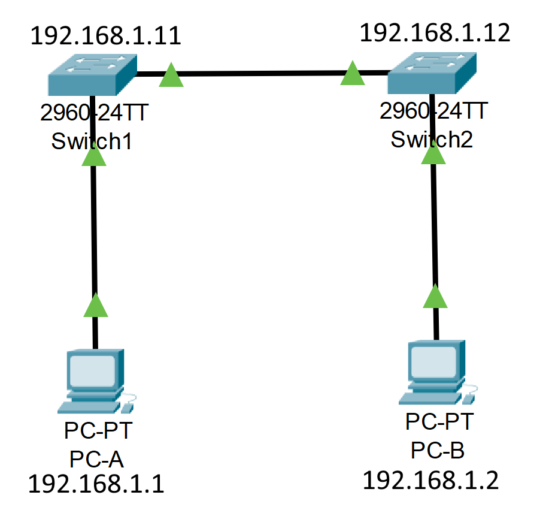
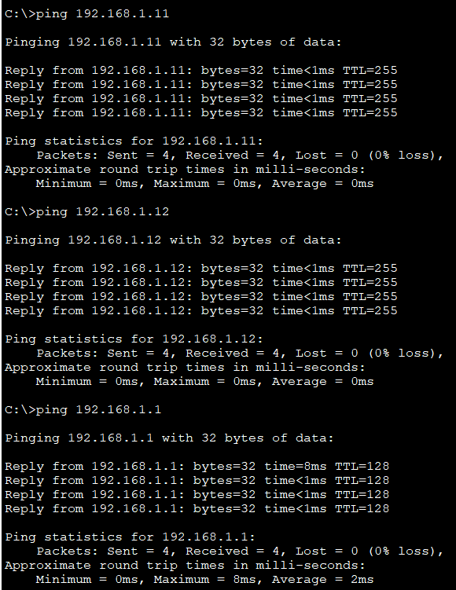
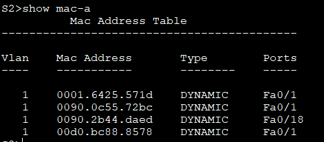
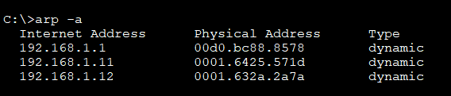

# Лабораторная работа. Просмотр таблицы MAC-адресов коммутатора
##  Цели
### Часть 1. Создание и настройка сети

### Часть 2. Изучение таблицы МАС-адресов коммутатора

## Выполнение:

### Создание и настройка сети:



Устройства подключены, сетевые интерфейсы настроены.


### МАС-адреса сетевых устройств:

MAC-адрес компьютера PC-A: `00D0.BC88.8578` 

MAC-адрес компьютера PC-B: `0090.2B44.DAED`


МАС-адрес коммутатора S1 Fast Ethernet 0/1: `0090.0c55.72bc`

МАС-адрес коммутатора S1 Vlan1: `0001.6425.571d`

МАС-адрес коммутатора S2 Fast Ethernet 0/1: `0090.2149.7607`

МАС-адрес коммутатора S2 Vlan1: `0001.632a.2a7a`

### Таблица МАС-адресов коммутатора S2:

```
S2# show mac-address-table
1   0090.0c55.72bc    DYNAMIC     Fa0/1 
```

Сетевая коммуникация ещё не происходила, в таблице есть только MAC первого порта коммутатора S1.
МАС-адреса Vlan1 нет.


**Если вы не записали МАС-адреса сетевых устройств в шаге 1, как можно определить, каким устройствам принадлежат МАС-адреса, используя только выходные данные команды show mac address-table? Работает ли это решение в любой ситуации?**

\- Можно сопоставить MAC-адрес устройства с портом из которого он приходит. Но работает это только если за этим портом конечное устройство, а не коммутатор, который пересылает данные дальше. В таком случае будет несколько MAC-адресов, одним из которых будет адрес самого коммутатора.

### Очищаем таблицу МАС-адресов:

```
S2# clear mac address-table dynamic
```

После очистки таблицы в первые 10 секунд MAC-адреса отсутствуют. Через 10 секунд снова появляется MAC первого коммутатора `0090.0c55.72bc`.

### Отправляем эхо-запросы с PC-B на S1, S2, PC-A:
Изначально, при вводе команды `arp -a` на PC-B адресов нет.

От всех устройств по эхо-запросам получены ответы.



Коммутатор S2 добавил МАС-адреса компьютеров PC-A и PC-B, а также MAC-адрес S1 Vlan1



В ARP-таблице появились записи всех сетевых устройств, которым были отправлены эхо-запросы.




##  Вопросы для повторения:

**В сетях Ethernet данные передаются на устройства по соответствующим МАС-адресам. Для этого коммутаторы и компьютеры динамически создают ARP-кэш и таблицы МАС-адресов. Если компьютеров в сети немного, эта процедура выглядит достаточно простой. Какие сложности могут возникнуть в крупных сетях?**


\- В крупных сетях, где подключено много устройств, таблицы MAC-адресов в коммутаторах могут быть очень большими, что может увеличить задержку при проверке и пересылке кадров. Также в крупных сетях могут встречаться одинаковые MAC-адреса на нескольких устройствах, что приведёт к ошибкам передачи кадорв.
